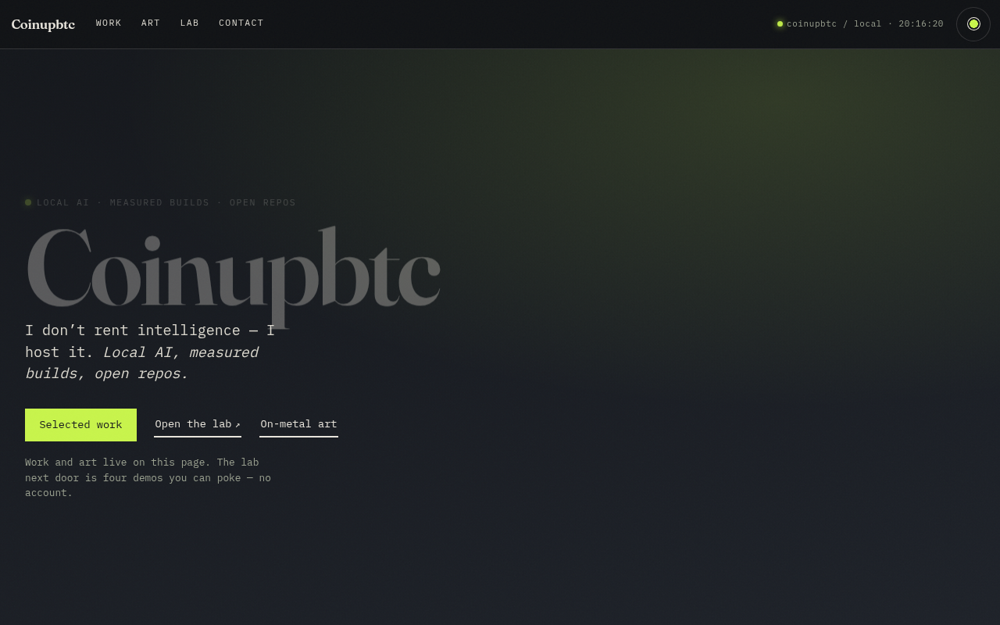

# Coinupbtc — Portfolio Site




## At a glance

| | |
|---|---|
| **What it is** | A single-page pseudonymous landing site for Coinupbtc. |
| **What it’s for** | The one link to hand out: GitHub, X, art made on your own hardware, public builds — no real name. |
| **How to use it** | Open https://coinupbtc.com/ — Work / Art / Lab / Contact in the top bar. Or `./setup.sh` for a local preview. |

## Try it

### One command
```bash
git clone https://github.com/Coinupbtc/Coinupbtc.github.io.git
cd Coinupbtc.github.io && ./setup.sh
# → http://127.0.0.1:8765/
```

Or open `index.html` in a browser (no build step).

Identity on this site is the handle **Coinupbtc** only. Live at **https://coinupbtc.com/** (GitHub Pages).

## Contact policy

Pseudonymous: no real name, employer, school, phone, or street address.
Inbound: [GitHub](https://github.com/Coinupbtc) · [X @coinupbtc](https://x.com/coinupbtc).

## Stack

One HTML + one CSS file. Fraunces + IBM Plex Mono via Google Fonts. No trackers, no cookies, no analytics.
The hero is an art-directed two-column composition: editorial display type + the local DGX Spark systems
topology rendered as a framed centerpiece plate, over a lightweight generative node-field canvas and a
cinematic locally-generated MiniMax-H3 clip as a muted full-bleed backplate (autoplay / muted / loop / webp
poster fallback, degenerate gracefully under `prefers-reduced-motion`).

## Art + video

`assets/art/` holds WebP stills generated locally on the DGX Spark (ComfyUI) — the live gallery
keeps the systems-topology plate; optical figure studies stay in the folder, unused.
`assets/video/` holds web-optimized copies of curated MiniMax-H3 clips (H.264 ≤960px wide, faststart, no
audio, tiny webp posters). The hero uses one clip as a background; the "Made on the machine" gallery is
video-first (hover to play, tap to open) plus that one still.

Curation is **explicit and by-id** in the export scripts (`scripts/export-art.py`, `scripts/export-video.py`)
— never glob the generator output folders into this repo.

To (re)build the web video assets from the local H3 library:

```bash
python3 scripts/export-video.py
```

## Custom domain

`CNAME` file → `coinupbtc.com`. At Porkbun, point apex A records to GitHub Pages IPs and `www` CNAME to `Coinupbtc.github.io`.

## License

MIT — see `LICENSE`.
