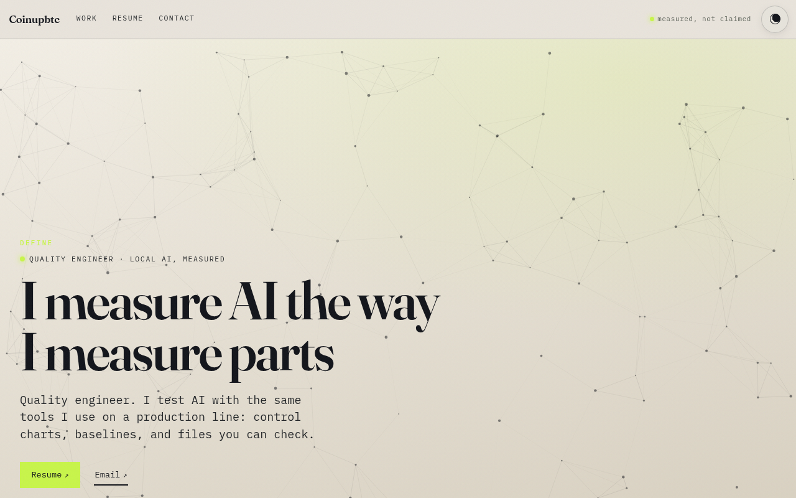

# Coinupbtc — Portfolio Site



## At a glance

| | |
|---|---|
| **What it is** | A single-page pseudonymous landing site for Coinupbtc. |
| **What it’s for** | The one link to hand out: GitHub, X @coinupbtc, email, and public measured builds. Alias only — no real name. |
| **How to use it** | Open https://coinupbtc.com/ — Work / Contact in the top bar. Or `./setup.sh` for a local preview. |

## Try it

### One command
```bash
git clone https://github.com/Coinupbtc/Coinupbtc.github.io.git
cd Coinupbtc.github.io && ./setup.sh
# → http://127.0.0.1:8765/
```

Or open `index.html` in a browser (no build step).

Identity on this site is the handle **Coinupbtc** only. Live at **https://coinupbtc.com/** (GitHub Pages).

## Contact policy

Pseudonymous: no real name, employer, school, phone, or street address.
Inbound: [GitHub](https://github.com/Coinupbtc) · [X @coinupbtc](https://x.com/coinupbtc) · coinupbtc@gmail.com.

## Stack

One HTML + CSS. Fraunces + IBM Plex Mono via Google Fonts. No trackers, no cookies, no analytics.
The hero is editorial display type over a lightweight generative node-field canvas (`#hero-field`) and a vignette. There is no video backplate.

## Media

The conference build does not publish a clip gallery or a model-generated share card.
`assets/og-image.png` is a still of that same node field, redrawn by `scripts/export-og.py` (Pillow, no model output).
`scripts/export-video.py` refuses to write hero, gallery, or share-card files.
`scripts/export-art.py` can still refresh unused stills in `assets/art/`; those stills are not mounted on the page and must not be wired into the hero or the share card.

## Custom domain

`CNAME` file → `coinupbtc.com`. At Porkbun, point apex A records to GitHub Pages IPs and `www` CNAME to `Coinupbtc.github.io`.

## License

MIT — see `LICENSE`.
